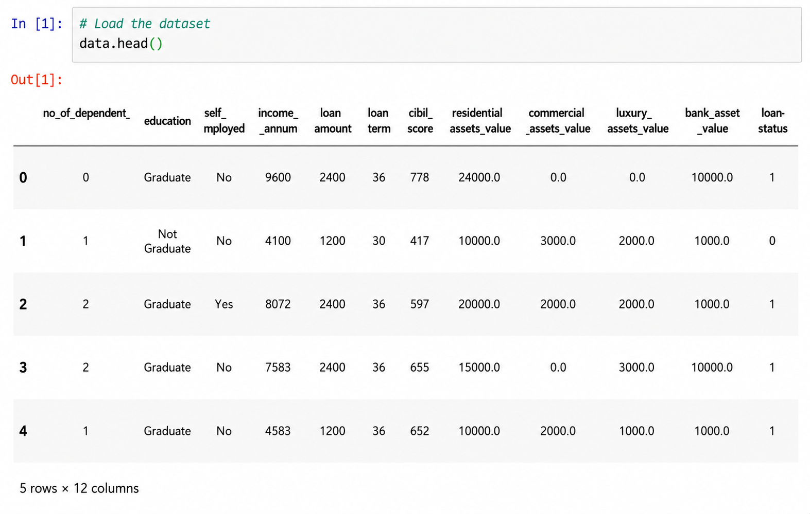
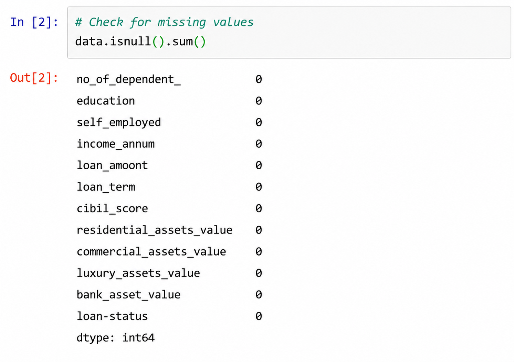
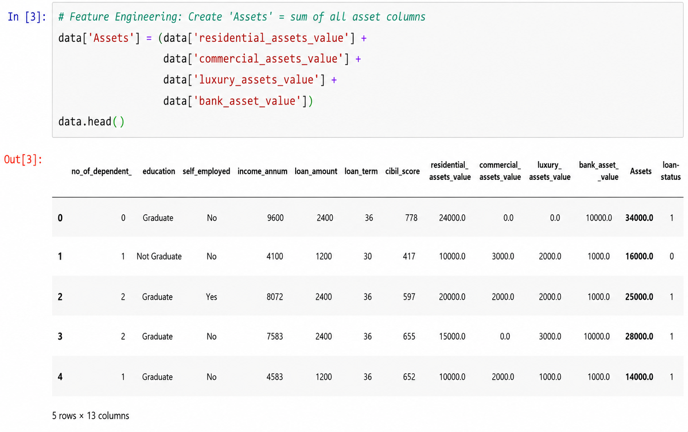
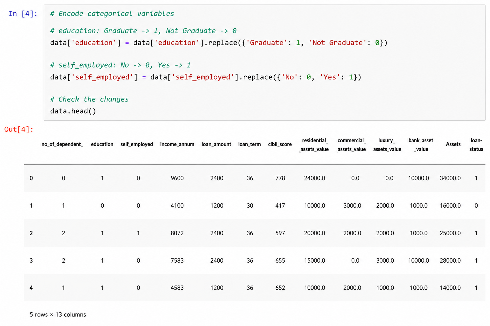
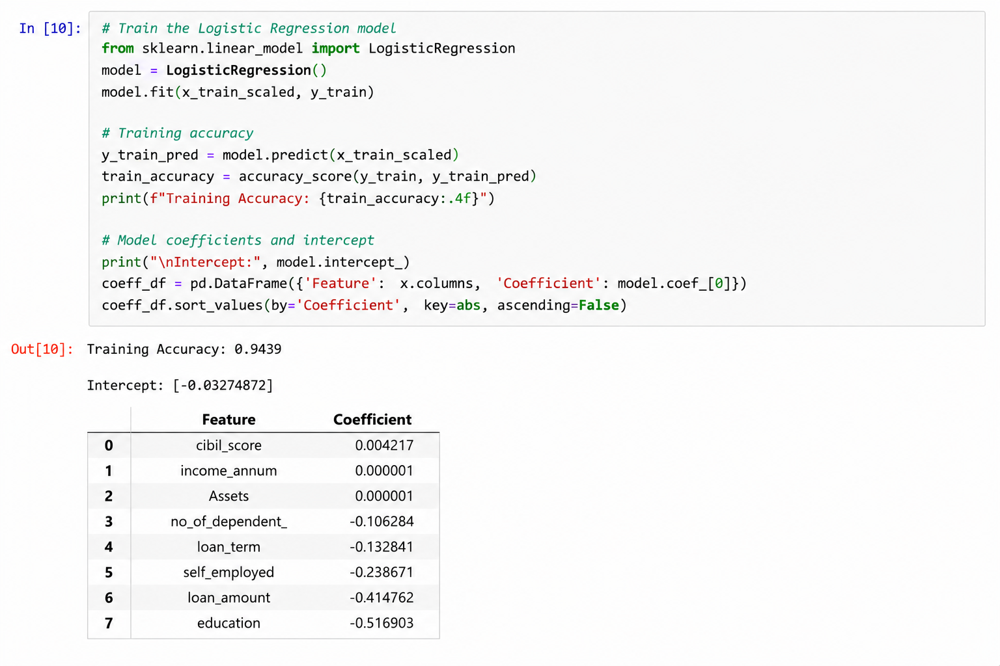
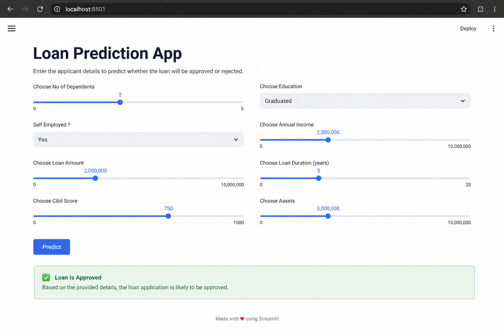
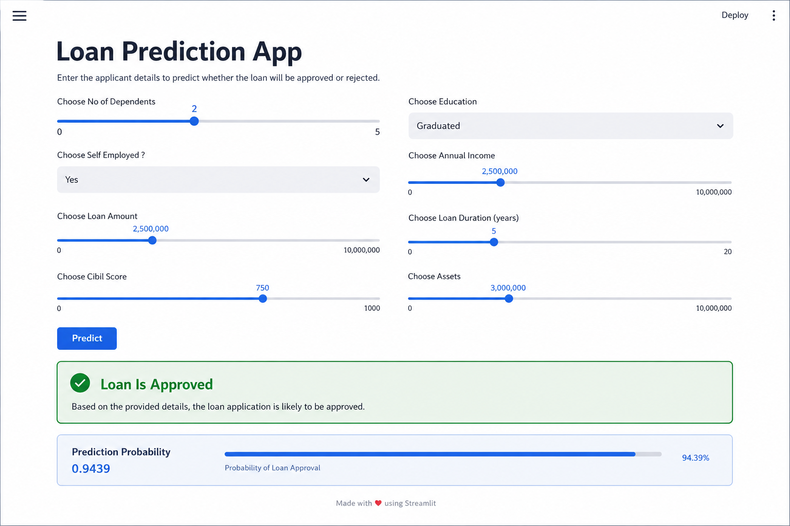

# 🏦 Loan Approval Prediction

A Machine Learning project that predicts whether a loan application will be approved based on applicant details. The project includes data preprocessing, feature engineering, Logistic Regression model training, and deployment using Streamlit.

---

## 📌 Features

- Data Cleaning
- Feature Engineering
- Missing Value Analysis
- Label Encoding
- Feature Scaling
- Logistic Regression
- Loan Prediction
- Interactive Streamlit Web App

---

## 🛠 Tech Stack

- Python
- Pandas
- NumPy
- Scikit-learn
- Streamlit
- Pickle

---

## 📂 Dataset Features

- Number of Dependents
- Education
- Self Employed
- Annual Income
- Loan Amount
- Loan Term
- CIBIL Score
- Total Assets
- Loan Status (Target)

---

## ⚙️ Workflow

1. Load Dataset
2. Data Cleaning
3. Feature Engineering
4. Encode Categorical Features
5. Feature Scaling
6. Train Logistic Regression Model
7. Save Model
8. Deploy with Streamlit

---

## 🤖 Model

- Algorithm : Logistic Regression
- Feature Scaling : StandardScaler

---

## 📸 Screenshots

### Dataset Preview

### Missing Values

### Feature Engineering

### Data Preprocessing

### Model Training

### Streamlit Application

### Prediction

---

## 🚀 Future Improvements

- Random Forest
- XGBoost
- Hyperparameter Tuning
- Cross Validation
- Cloud Deployment

---

## 👨‍💻 Author

**Abhishek Prajapati**
